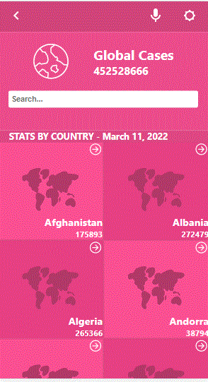
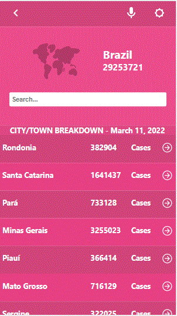

# CovidMonitor

> This web app is specially created on Covid. It basically shares information about the Covid Situation such as

- Worldwide Cases
- Countrywise Cases

## ScreenShots

## Built With

- HTML
- CSS
- JavaScript

## Video Walkthrough

https://www.loom.com/share/ee8dcdcc603f41bb97a17a6250b357b0

## Authors

👤 **HAMMAS BIN SALEEM**
- GitHub: [@HAMMAS-SALEEM](https://github.com/HAMMAS-SALEEM)
- Twitter: [@HammasSaleem4](https://twitter.com/HammasSaleem4)
- LinkedIn: [HAMMAS SALEEM](https://www.linkedin.com/in/hammas-saleem)

## 🤝 Contributing
Contributions, issues, and feature requests are welcome!
Feel free to check the [issues page](../../issues/).

## Show your support
Give a ⭐️ if you like this project!

## Acknowledgments
The original design is from [Nelson Sakwa on Behance](https://www.behance.net/sakwadesignstudio).
